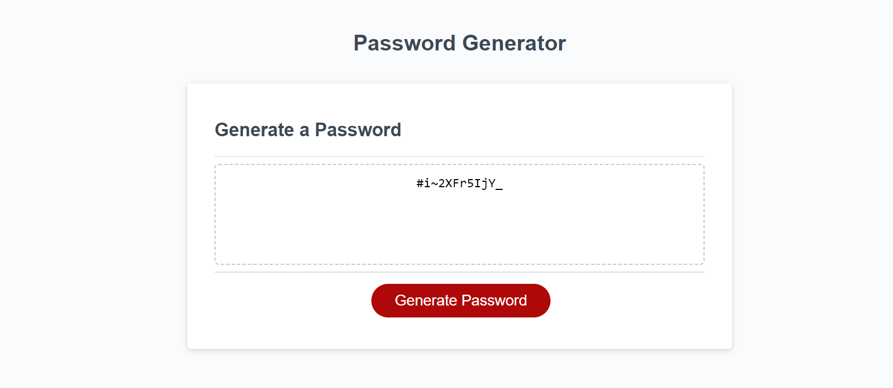

# Password Generator App

## Display

HTML and CSS is added to display the page in a browser.

## Function

javaScript code allows to get the user choice by prompts.
The function generates the password accordingly.

## Usage

When clicked on Generate Password button, a series of prompts appear asking the the length and character types.
Once confirmed the password appears in the text area.

## Unacomplished

The app is supposed to display a message when no character type is selected.

## Sreenshot

